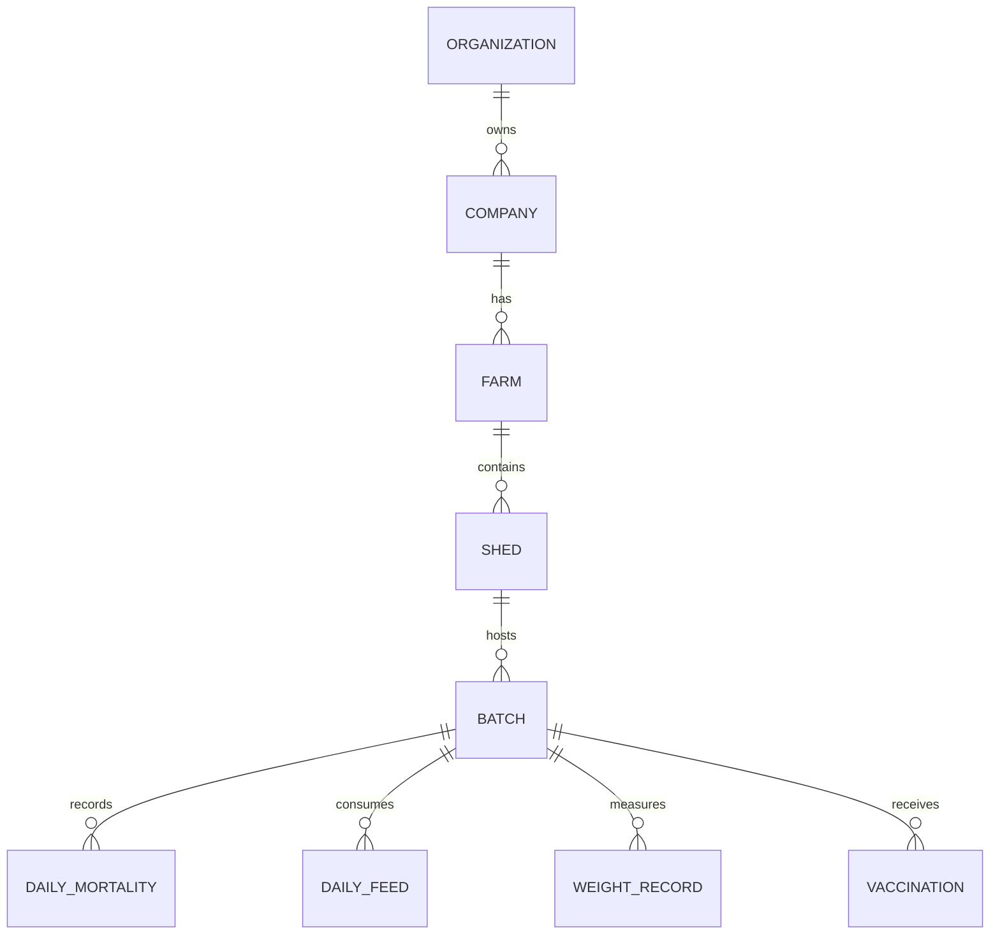

# Relationship Map

## 1. Core Relationships

### Organization to Company
- **Type**: One-to-Many
- **Rule**: Restrict (Cannot delete org if companies exist)
- **FK**: `Company.tenant_id -> Organization.id`

### Company to Farm
- **Type**: One-to-Many
- **Rule**: Cascade or Restrict (typically Restrict)
- **FK**: `Farm.company_id -> Company.id`

### Farm to Shed
- **Type**: One-to-Many
- **Rule**: Cascade
- **FK**: `Shed.farm_id -> Farm.id`

### Shed to Batch
- **Type**: One-to-Many
- **Rule**: Restrict (Cannot delete shed if it has batches)
- **FK**: `Batch.shed_id -> Shed.id`

### Batch to DailyMortality, DailyFeedConsumption, WeightRecord
- **Type**: One-to-Many
- **Rule**: Cascade
- **FK**: `DailyMortality.batch_id -> Batch.id`

## 2. Many-to-Many Relationships

### User to Role
- **Junction**: `UserRole`
- **FKs**: `user_id`, `role_id`

### Role to Permission
- **Junction**: `RolePermission`
- **FKs**: `role_id`, `permission_id`

### FeedFormula to FeedType/Ingredients
- **Junction**: `FeedFormulaIngredient`
- **FKs**: `formula_id`, `item_id`

## 3. Text Diagram

## 4. Referential Integrity Rules
- Transactions must strictly RESTRICT deletion of Master Data entities if used.
- Master data entities can CASCADE delete their localized child metadata (e.g. translation names).
- All tables must reference `tenant_id` directly for Row Level Security (RLS) enforcement.
