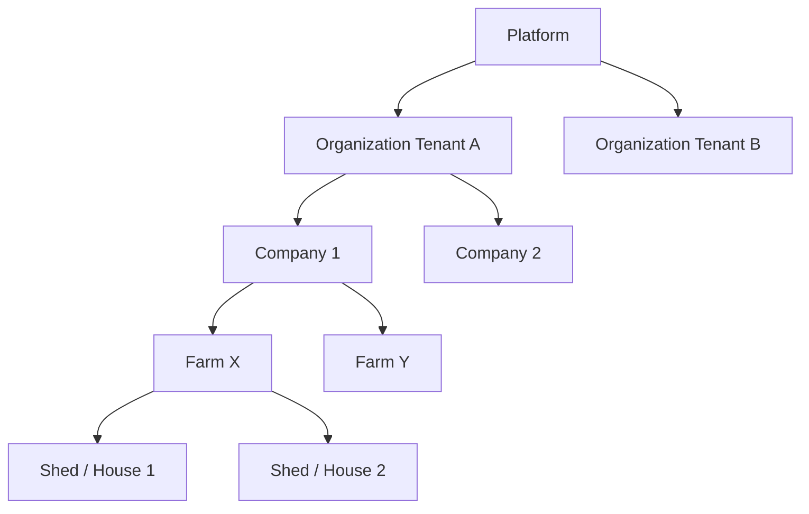

# Enterprise SaaS Architecture & Multi-Tenancy

## 1. Tenant Hierarchy

The Poultry Management ERP SaaS platform uses a hierarchical model to support businesses ranging from independent single farms to multi-national integrated poultry corporations.

### Hierarchical Levels
*   **Platform Level**: The global SaaS application managed by the software provider. Super Admins operate here.
*   **Organization Level (Tenant)**: The top-level billing and isolation boundary for a customer. Data is strictly isolated at this level.
*   **Company Level**: Sub-entity within an organization, used for multi-company holding structures or different regional subsidiaries. Each company can have distinct financial books and tax setups.
*   **Farm Level**: The physical operational unit where poultry rearing or production happens (e.g., Broiler Farm, Breeder Farm, Hatchery).
*   **Location/Shed Level**: The physical structures within a farm where batches/flocks are placed.

### Data Isolation
*   **Inter-Organizational**: Strict isolation. A user in Tenant A cannot access data in Tenant B under any circumstances.
*   **Intra-Organizational**: Controlled by RBAC. A Farm Manager at Farm X cannot see data for Farm Y, but the Company Admin can see both.

## 2. Multi-Tenancy Model

### Options Evaluated

| Model | Pros | Cons |
| :--- | :--- | :--- |
| **Shared DB, Shared Schema** (Row-level isolation) | Highly scalable, lowest cost, easiest schema migrations, best for small/medium tenants. | "Noisy neighbor" problem, highest risk of data leakage if queries miss `tenant_id` filter, harder to restore a single tenant from backup. |
| **Shared DB, Separate Schemas** | Stronger logical isolation, easier per-tenant backup/restore, moderate cost. | Connection pooling issues, migration complexity grows linearly with tenant count. |
| **Separate Databases per Tenant** | Ultimate isolation, perfect for enterprise compliance, no noisy neighbor issue. | Highest cost, management overhead, difficult to maintain 1,000+ DBs. |

### Recommended Architecture: Hybrid Model (Shared Schema + Dedicated DB for Enterprise)
*   **Default (Free/Starter/Pro Tiers)**: **Shared Database, Shared Schema** using a mandatory `tenant_id` column on every tenant-specific table. Row-Level Security (RLS) in the database (e.g., PostgreSQL) enforces isolation at the database engine level to prevent application-layer leakage.
*   **Enterprise Tier**: **Dedicated Database**. For massive integrated operators requiring strict data residency, dedicated performance, or compliance (e.g., publicly traded agrifood giants), we provision a separate database instance.

*Reasoning*: The platform must scale to 1,000+ tenants quickly. Managing 1,000 separate schemas or DBs early on is an operational nightmare. The hybrid model provides cost-efficiency for the long tail while capturing high-margin enterprise deals.

## 3. Organization Hierarchy

*   **Super Admin (Platform Level)**: Employees of the SaaS provider. Manage billing, support, global reference data (e.g., standard breeds), and platform settings.
*   **Organization (Tenant)**: The subscribed entity. Defines the global settings for the customer (default currency, timezone).
*   **Company**: Logical grouping for accounting and regional management.
*   **Farm**: Operational node. Costs, inventory, and production metrics are aggregated here.
*   **Shed/House**: Granular tracking unit. Batches are assigned to sheds. FCR, mortality, and feed consumption are tracked per shed.

## 4. Subscription & Billing

### Plan Tiers
| Tier | Target Audience | Key Features | Limits |
| :--- | :--- | :--- | :--- |
| **Trial** | Prospects | All features | 14-day limit, 1 Farm |
| **Starter** | Independent Farmers | Flock management, basic inventory, basic expenses. | 1 Farm, 3 Users, Community Support |
| **Professional** | Medium Multi-Farm Orgs | Multi-farm, advanced inventory, financials, feed mill, veterinarian module. | 5 Farms, 15 Users, Standard Support |
| **Enterprise** | Integrated Corporations | Multi-company, contract farming, custom reporting, API access, SSO, dedicated DB. | Unlimited Farms/Users, Premium SLA |

### Billing Architecture
*   **Engine**: Stripe Billing (or similar) integrated via API.
*   **Usage-Based Elements**: If limits are exceeded (e.g., 6th farm added on Pro plan), prompt for upgrade. Alternatively, charge per active bird/batch size as a metric.
*   **Cycles**: Monthly or Annual (with discount).
*   **Flows**:
    *   *Trial Conversion*: Warning emails at 7, 3, and 1 days before expiry. Grace period of 3 days post-expiry before read-only lock.
    *   *Suspension*: Failed payment triggers 3 retries over 7 days. On 8th day, account is suspended (read-only). On 30th day, account deactivated.

## 5. Tenant Lifecycle

1.  **Registration/Onboarding**: Self-service signup via web portal. Captures admin details, business name, and region.
2.  **Provisioning**: Background job creates Tenant record, provisions default roles, and initializes data.
3.  **Configuration**: Wizard for setting locale, currency, unit system (metric/imperial for weights, Celsius/Fahrenheit for temp).
4.  **Data Seeding**: System copies global reference data (e.g., Cobb 500 growth standards, common vaccines) into the tenant's context, which they can then customize.
5.  **Export**: Self-service tool to export all data in CSV/JSON (GDPR/Data Portability compliance).
6.  **Deletion (Offboarding)**: Soft delete immediately. Hard delete after 30-day retention period.
7.  **Backup/Restore**: Nightly automated platform-wide backups. Enterprise tenants get on-demand point-in-time recovery.

## 6. Feature Flags

Feature flags control module access based on the tenant's subscription tier.

| Feature Flag ID | Description | Starter | Professional | Enterprise |
| :--- | :--- | :--- | :--- | :--- |
| `module.multi_farm` | Support for >1 Farm | No | Yes | Yes |
| `module.financials` | Advanced accounting & P&L | No | Yes | Yes |
| `module.feed_mill` | Feed formulation and production | No | Yes | Yes |
| `module.contract_farming` | Manage contract farmer networks | No | No | Yes |
| `integration.erp_api` | REST API access for external tools | No | No | Yes |
| `security.sso` | SAML/OAuth Single Sign-On | No | No | Yes |
